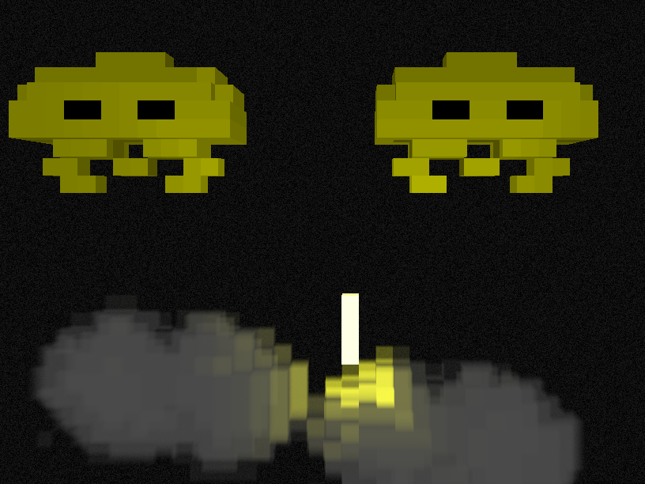

# Volumatrix

Volumatrix is a simple voxel-based game engine for adding depth to flat pixel games like space invaders.

Features:

- volumetric lighting model

- transparency and density of materials - the light permeability of the boundaries of the voxel and the internal volume, respectively

- limited depth (x-dimension) - grid depth of more than 8 voxels can lead to poor performance on weak hardware

- fixed viewing angle - the camera is always directed along the x coordinate of the grid

